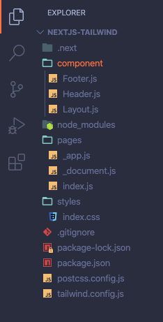

## NextJS + TailwindCSS + Layouting 


---

Saya mencoba untuk membuat sebuah Starter / mungkin bisa disebut boilerplate yang terinspirasi dari postingan di Dev.to, mengenai menggunakan NextJS dan TailwindCSS disaat bersamaan [Get up and running with Tailwind CSS and Next.js](https://dev.to/notrab/get-up-and-running-with-tailwind-css-and-next-js-3a73) . 

### 🥰Kenapa membuat Starter ?

Karena saya sering menggunakan NextJS untuk beberapa proyek saya, sehingga saya mencoba untuk membuat starternya agar tidak perlu lagi untuk setup ulang beberapa hal yang sudah pasti saya gunakan. Misalnya setting TailwindCSS pada config dan PostCSS atau setting pada NextJS untuk membuat Layouting, Apps dan Document di NextJS. 

Sebenarnya, penambahannya tidak terlalu banyak. Hanya menambahkan component Layouting, dan Document di NextJS. Namun, tidak menutup kemungkinan, saya akan menambahkan Starter lain untuk Redux. Ini murni juga biar saya tidak perlu setup dari awal lagi. 

---

Kurang lebih isi foldernya nanti seperti ini :

 

Package JSON kurang lebih isinya seperti ini :

```
 "dependencies": {
    "next": "^9.4.1",
    "react": "^16.13.1",
    "react-dom": "^16.13.1"
  },
  "devDependencies": {
    "postcss-preset-env": "^6.7.0",
    "tailwindcss": "^1.4.6"
  }

```
###  👨🏻‍🔧Tertarik Menggunakan ?

Kodenya terbuka dan bisa diakses di 
  👨🏼‍💻Github [NextJS+Tailwind](https://github.com/naufaldi/nextjs-tailwind/tree/master)