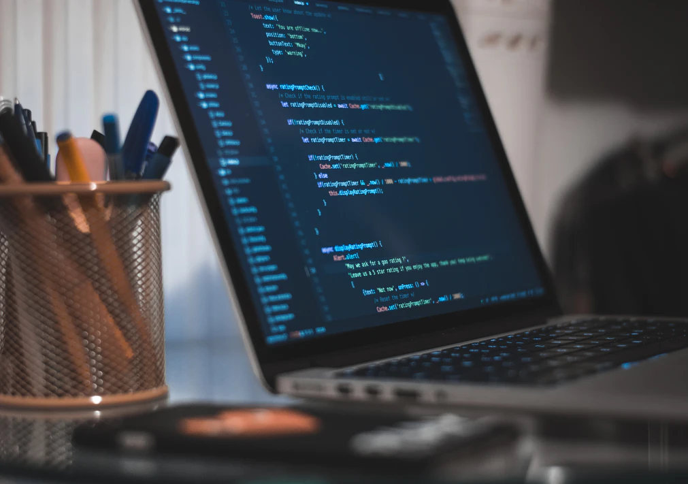
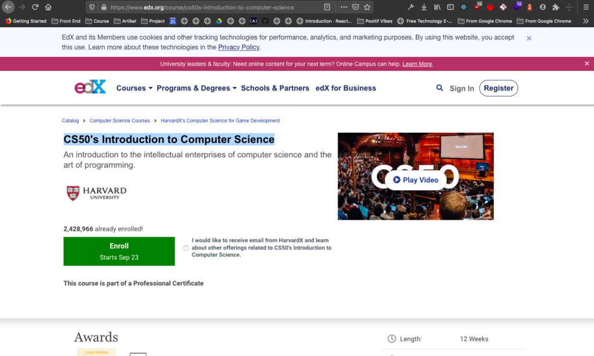
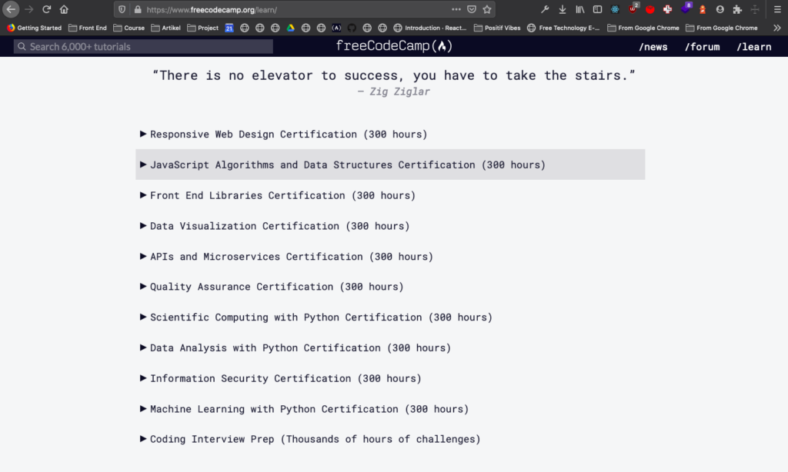
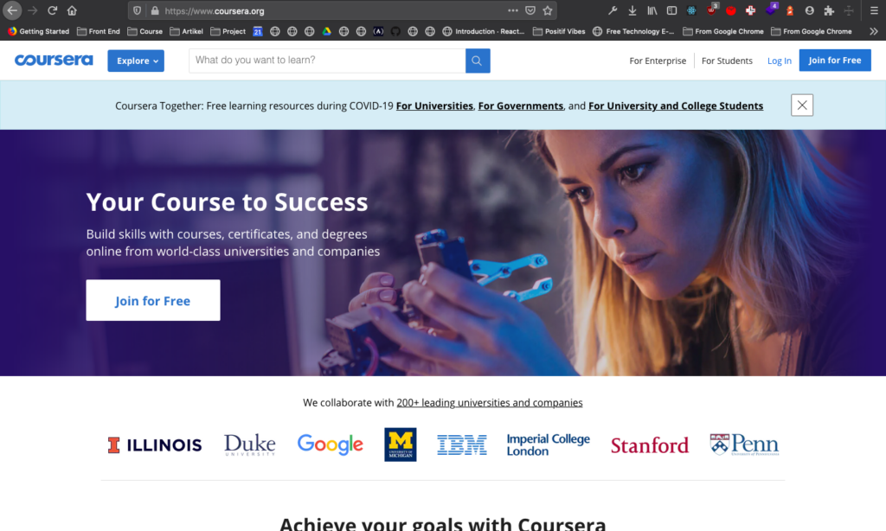

## Tidak Peduli Siapa Kamu, Bagaimana Backgroundmu

---
Sering sekali saya mendapatkan pertanyaan dari Quora Indonesia mengenai pengembang perangkat lunak terutama yang berkaitan dengan "Siapa saja yang bisa menjadi pengembang perangkat lunak".

Tentu saja, jawabannya selalu sama. **"SIAPA SAJA BISA MENJADI PENGEMBANG PERANGKAT LUNAK."** Beberapa pertanyaannya mungkin seperti ini
1. [Apa saran terbaik untuk para perempuan yang tertarik mempelajari pemrograman?](https://id.quora.com/Apa-saran-terbaik-untuk-para-perempuan-yang-tertarik-mempelajari-pemrograman)
2. [Apakah bisa seseorang yang berlatarbelakang anak soshum dapat mempelajari pemrograman dan semacamnya?](https://id.
quora.com/Apakah-bisa-seseorang-yang-berlatarbelakang-anak-soshum-dapat-mempelajari-pemrograman-dan-semacamnya)

Serta masih banyak pertanyaan lainnya yang serupa seperti hal tersebut. Mungkin akan saya tambahkan bila saya ingat. 

---

Kalau orang pada bertanya kepada saya, kenapa bisa semua orang menjadi pengembang perangkat lunak? Karena pemrograman bukanlah ilmu kesehatan yang harus dipelajari dari senior / kuliah, bukan pula ilmu yang mengharuskan kita bisa matematika dan syarat lainnya. Menjadi pemrogram itu bisa dipelajari oleh siapa saja, kapan saja, dimana saja dan siapapun. 

Karena materi, bahan bacaan / tutorial tersebar luas di internet, youtube dan website sejenis yang menawarkan sumber belajar. Ada komunitas yang dengan sedia mau membantu untuk belajar pemrograman. Ada orang-orang baik yang mau membantu menjadi mentor kita, memberikan jawaban dan penjelasan terhadap permasalahan atas suatu kode bila kita menemukan stuck dalam koding. 

**Tidak percaya?**

**CS50's Introduction to Computer Science**, Bisa teman-teman akses secara gratis di Edx!

[CS50's Introduction to Computer Science](https://www.edx.org/course/cs50s-introduction-to-computer-science)

**[Freecode Camp](https://freecodecamp.org)**, memberikan kursus untuk mendapatkan sertifikat sebagai Frontend, Data, Backend, Machine Learning dst secara gratis.

**[Coursera](https://coursera.com)**, juga memberikan kursus daring secara gratis. Tidak hanya universitas, melainkan perusahaan besar memberikan kursus secara gratis pula.

---
Tidak banyak bukan, jurusan-jurusan yang memberikan materi perkuliahan secara gratis, memberikan sertifikat secara gratis? Bahkan ada banyak sekali tools yang bisa kita gunakan apabila kita masih pelajar untuk mendapatkan benefit dari perusahaan ternama. 

Pekerjaan seorang pemrogram juga tidak mengenal umur dan jurusan kok. Ada banyak cerita orang orang yang telah membuktikannya. 

- [How I landed a full stack developer job without a tech degree or work experience](https://www.freecodecamp.org/news/how-i-landed-a-full-stack-developer-job-without-a-tech-degree-or-work-experience-6add97be2051/)
- [Stories from 300 developers who got their first tech job in their 30s, 40s, and 50s](https://www.freecodecamp.org/news/stories-from-300-developers-who-got-their-first-tech-job-in-their-30s-40s-and-50s-64306eb6bb27/)
- [My journey to becoming a web developer from scratch without a CS degree (and what I learned from…](https://www.freecodecamp.org/news/my-journey-to-becoming-a-web-developer-from-scratch-without-a-cs-degree-2-years-later-and-what-i-4a7fd2ff5503/)
- [How I dropped out and got a job as a developer in India at the age of nineteen](https://www.freecodecamp.org/news/how-i-dropped-out-and-got-a-job-as-a-developer-in-india-at-the-age-of-nineteen-3e8c30b83cce/)
- [How to Become a Software Engineer if You Don't Have a Computer Science Degree](https://www.freecodecamp.org/news/paths-to-becoming-a-software-engineer/)

Software House, Startup di Indonesia menerima seseorang sebagai pengembang perangkat lunak tidak sekedar berdasarkan gelar saja. Melainkan, karena portfolio, hasil interview / wawancara, test dan lain sebagainya. Intinya, parameternya tidak hanya ada pada gelar saja. 

---

Akhir kata bagi saya, tidak masalah tidak peduli siapa kamu, dimana kamu, darimana kamu. Selama ada niat, usaha, maka saya yakin. Kita bisa menjadi seorang pengembang perangkat lunak.